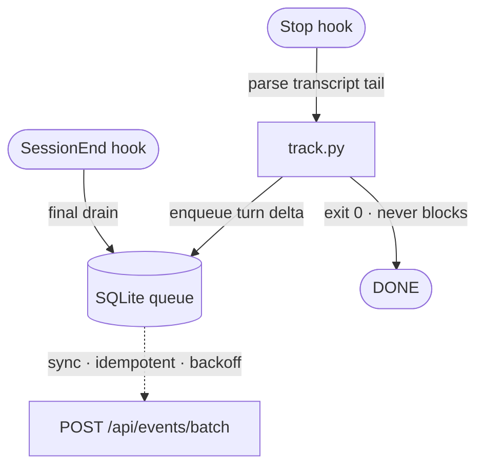

# Plugin

The Claude Code plugin half of Claude Usage. Its `Stop`/`SessionEnd` hooks run on
every turn and **never block the session** — they parse the turn's transcript, write
to a local durable queue, and sync to the server in the background. See the
[root README](../README.md) for the whole system.

## Layout

- [`.claude-plugin/plugin.json`](.claude-plugin/plugin.json) — plugin manifest and its
  `userConfig` (`API_KEY`, `BASE_URL`).
- [`hooks/hooks.json`](hooks/hooks.json) — registers the `Stop` and `SessionEnd` hooks.
- [`scripts/`](scripts/) — the hook implementation:

| File | Role |
|---|---|
| `scripts/track.py` | **Stop** hook. Reads hook stdin, parses the transcript's new tail, builds a per-turn usage event, enqueues it, kicks off a drain, and exits `0`. Pure observer — never writes decision output. |
| `scripts/sync.py` | **SessionEnd** hook (and the drain step). Ships queued events to the server with `Authorization: Bearer` and backoff; removes them once the server confirms. |
| `scripts/storage.py` | The local SQLite outbox at `$CLAUDE_PLUGIN_DATA/events.db` (`enqueue` / `claim_pending` / `mark_synced` / …), with exponential backoff and dead-lettering. |
| `scripts/transcript.py` | Incremental transcript parsing — reads only the bytes appended since the last turn and returns that turn's token/cost delta. |
| `scripts/state.py` | Per-session parse state (byte offset, turn index, cumulative cost) at `$CLAUDE_PLUGIN_DATA/state.json`, so each turn is read once. |
| `scripts/config.py` | Reads config (`API_KEY`, `BASE_URL`) and resolves data-dir paths. |
| `scripts/pyproject.toml` | Lets `uv run` provision Python (stdlib only — no third-party deps). |

## How it works



Each Stop hook records a single **turn** (the delta since the last one), so the
server stores a turn-by-turn timeline rather than repeated cumulative snapshots.

If the server is down, events stay `pending` in the local queue and sync on a later
run — **zero data loss**.

- **Identity** is the `API_KEY` (resolved to a user server-side); it is never
  self-reported in the payload.
- **`account_email`** is read live from `~/.claude.json` each run — the shared Claude
  account the usage is billed against.
- Only **metrics** are sent per turn — token counts, model, cost, session ID, and
  `cwd`. Prompts, assistant responses, and tool inputs/outputs are **never** sent.

## Configuration

Set at install as the plugin's `userConfig` and injected into the hooks as
environment variables:

| Config | Notes |
|---|---|
| `API_KEY` | Sensitive. Generated for you in the dashboard. |
| `BASE_URL` | The Claude Usage server URL. |

## Install

Install via the marketplace (see the [root README](../README.md) for all methods):

```bash
claude plugin install claude-usage@claude-usage \
  --config API_KEY=<key> --config BASE_URL=<server-url>
```

## Development

Add the marketplace from a local checkout instead of GitHub, then install:

```bash
claude plugin marketplace add /path/to/claude-usage-plugin
```

Hooks are declared in [`hooks/hooks.json`](hooks/hooks.json) and invoked with
`uv run --project ${CLAUDE_PLUGIN_ROOT}/scripts python ${CLAUDE_PLUGIN_ROOT}/scripts/<script>.py`,
so `uv` provisions the Python runtime automatically — nothing to install by hand.
Runtime data (the queue and logs) lives under `${CLAUDE_PLUGIN_DATA}`.
